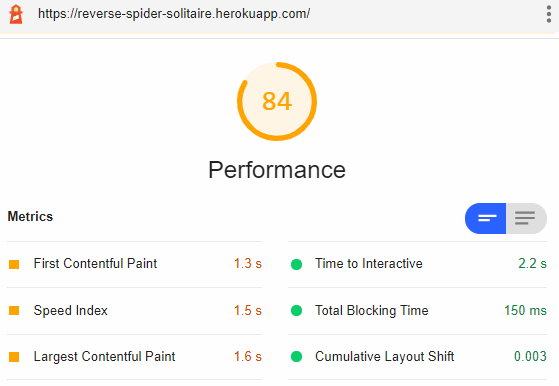
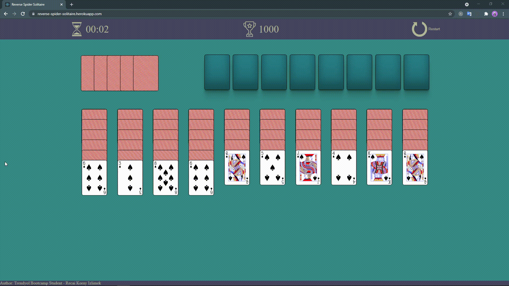

# Reserve Spider Solitaire

The final project of 112. Trendyol Frond-End Bootcamp is reverse spider solitaire just like spider solitaire. There is a simple difference. The aim of the game is to arrange the cards from A to K. The game is over when the cards have been successfully lined up eight times.

## Technologies

- React Js
- SASS
- Jest
- Cypess
- Heroku
- React Dnd

## Demo

[Reverse Spider Solitaire App](https://reverse-spider-solitaire.herokuapp.com/)

## Scoring System

- The game starts from 1000 points at the beginning.
- Each card move loses 10 points.
- Each time the deck deals cards (10 cards are dealt once clicked), 50 points are lost.
- When a set of cards is made (in order Ace-2-3-4-5-6-7-8-9-10-Jack-Queen-King), 500 points are earned.

## App Performance

## Unit Testing

## End to End Testing

## Preview

### Drag And Drop

### Draw Card From Deck

### Warning

### Restart

### Complete A Card Set

### Game Over

